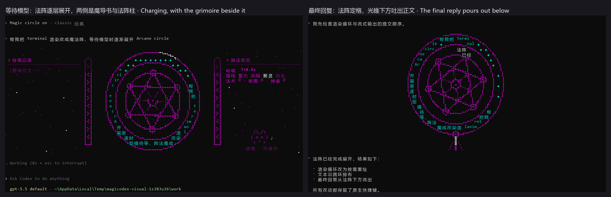
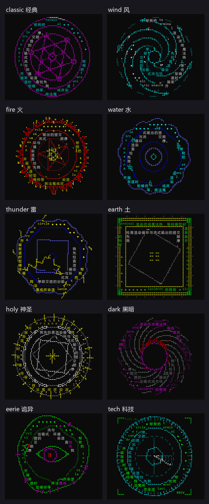
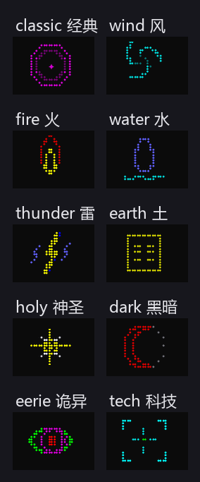
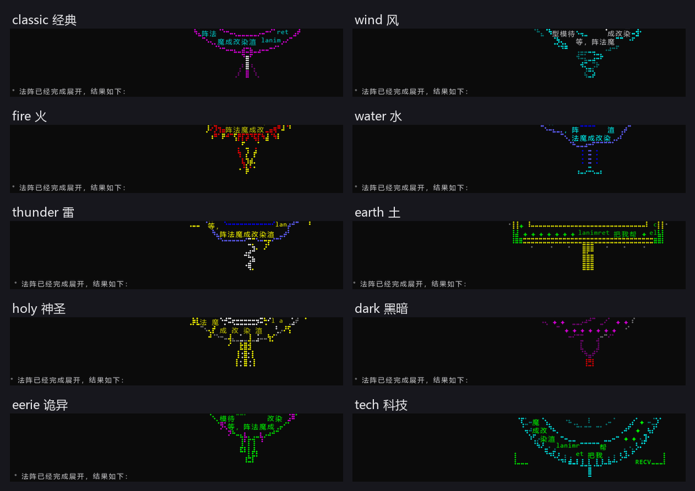

# Magicodex

Magic circles in your terminal · 终端里的魔法阵

<details>
<summary><b>English</b> (click to expand)</summary>

> **Still staring at your terminal, bored, waiting for the model to reply?**
>
> Now fate offers you a choice: **take the class change and become an AI Priest.**
>
> Wield ten schools of magic circles: Wind, Fire, Water, Thunder, Earth, Holy, Dark, Eerie, Tech and Classic. Make your prompt the incantation and your wait the offering, and raise your prayer in the terminal. The longer you wait, the vaster and more intricate the circle grows, as your incantation and the whispers of the gods orbit its rings. When the oracle descends, the circle seals and light pours from its heart. Be still and listen: this is the guidance of the Model God.
>
> The wait won't get any shorter. It just won't be boring anymore.

Let your AI coding assistant cast spells in the terminal. When you submit a prompt, an anime-style magic circle unfolds in your terminal, growing bigger and more intricate the longer you wait. Your prompt and the model's intermediate replies orbit its rings. When the final answer arrives, the spell takes effect and the text pours out from below the circle.

Works with **GitHub Copilot CLI** and **OpenAI Codex CLI**. The original program's interface, shortcuts, commands and default prompt stay unchanged. If you'd rather not see the circle, type `/magic off` to turn it off.


## Features

- **Grows while you wait**: before you type, there's only a small circle 5 rows tall. It grows as soon as you submit, then adds another layer of detail every few seconds until the model first replies.
- **Words woven into the circle**: your prompt orbits the outer ring and intermediate replies orbit the inner ring. The model's reasoning is never shown.
- **Answers born from the circle**: when the final reply begins, the circle freezes, light shines down from its center, and the reply appears below the circle.
- **10 magic circles**: Classic, Wind, Fire, Water, Thunder, Earth, Holy, Dark, Eerie and Tech. Each has its own shape, motion, text path, idle emblem and outlet, not just a different color. Preview and pick one with `/magic list`.
- **Stays out of the way**: `/magic` commands are handled locally and never sent to the model. The animation makes no extra model calls and uses no quota.

## Choose a version

| You use | Choose | Command after install | How it works |
| --- | --- | --- | --- |
| GitHub Copilot CLI | **copilot** (prerelease) | `magicopilot` | Runs the original Copilot CLI you installed and draws the circle above it |
| OpenAI Codex CLI | **codex** (stable) | `magicodex` | Rebuilt from the Codex 0.153.4 source with a patch; the interface is the original Codex |
| A fully custom-drawn interface | standalone (the earliest version) | `magicodex-standalone` | A standalone frontend that talks to Codex through its app-server, with only one circle |

Why isn't the Copilot version a patch? The Copilot CLI license doesn't allow modifying it, so magicopilot is a wrapper: it starts the unmodified Copilot CLI you installed yourself and adds a magic circle area above it.

## Installation

**Prerequisites**

- Windows 10/11 x64; [Windows Terminal](https://aka.ms/terminal) is recommended.
- copilot: GitHub Copilot CLI installed and signed in (`npm install -g @github/copilot`; verified on 1.0.87).
- codex: a Codex account (a ChatGPT account or an API key). You don't need to install the official Codex separately.
- standalone: Codex CLI installed and configured. `magicodex-standalone --demo` runs an offline demo.
- The repository is currently private, so downloading requires a signed-in [GitHub CLI](https://cli.github.com/) (`gh auth login`).

**Steps**

1. Download the installer:

   ```powershell
   gh release download --repo dengyanbo/Magicodex --pattern install.ps1 --clobber
   ```

2. Run the installer and choose a version from the menu (`-AddToPath` adds the commands to PATH):

   ```powershell
   powershell -ExecutionPolicy Bypass -File .\install.ps1 -AddToPath
   ```

   You can also name the version directly: `-Variant copilot`, `-Variant codex` or `-Variant standalone`.

3. Open a **new** terminal window and run `magicopilot` or `magicodex`.

The installer first verifies the downloaded files against `SHA256SUMS.txt`, then installs them to `%LOCALAPPDATA%\Magicodex`. Without `-AddToPath`, it leaves PATH alone. It runs on both Windows PowerShell 5.1 and PowerShell 7. You can also download a zip from the [Releases](https://github.com/dengyanbo/Magicodex/releases) page, extract it and run it directly.

<details>
<summary>All installer options</summary>

| Option | Effect |
| --- | --- |
| `-Variant codex\|copilot\|standalone` | The version to install; shows a menu if omitted |
| `-Version <x.y.z>` | A specific version; defaults to the latest (stable releases first) |
| `-List` | Lists available releases and installed versions |
| `-AddToPath` | Adds the command directory to your user PATH |
| `-Uninstall -Variant <variant>` | Uninstalls |
| `-InstallDir <dir>` | Install location; `%LOCALAPPDATA%\Magicodex` by default |
| `-Source <dir>` | Installs from a downloaded zip and `SHA256SUMS.txt`, without going online |
| `-Force` | Downloads and reinstalls a version that is already installed |

</details>

## Usage

### Copilot CLI: `magicopilot`

Start `magicopilot` instead of `copilot`; every other argument is passed to Copilot unchanged:

```powershell
magicopilot                         # just like copilot, plus the magic circle
magicopilot --resume                # resume an earlier session
magicopilot --magic-style thunder   # start with the Thunder circle
```

The circle is on by default and drawn above Copilot's interface: 5 rows when idle, 21 while casting and 24 while releasing the answer, and Copilot always keeps at least 14 rows. When Copilot asks for permission, the circle shrinks to make room; in windows shorter than 19 rows it hides automatically. More options are described in [copilot/README.md](copilot/README.md) (in Chinese).

### Codex CLI: `magicodex`

Run `magicodex`; the first time, sign in with `magicodex login`. It takes the same arguments as the official `codex`.

The circle is **off** by default, so you get the original start screen; type `/magic on` in the input box to turn it on. The circle is drawn above the input box, and the final reply unfolds from the outlet below it and stays in the transcript. `/magic off` also hides the circles in the history, without affecting the replies themselves.



`magicodex-bridge` is only for setups that already have a local copilot-proxy bridge configured; most people won't need it.

### Commands

In either version, type these commands **in the input box** and press Enter:

| Command | Effect |
| --- | --- |
| `/magic on` / `/magic off` | Shows / hides the circle |
| `/magic list` (or just `/magic`) | Opens the list of styles: ↑↓ previews as you move, Enter selects, number keys select directly, Esc cancels |
| `/magic <style>` | Switches directly, e.g. `/magic fire` or `/magic 火` |

These commands are handled locally and never sent to the model. Settings only last for the current run and go back to the defaults when you restart. In Codex, don't pass `/magic on` as a command-line argument, or it will be sent to the model as a prompt.

## 10 magic circles



| Style | Looks | Moves |
| --- | --- | --- |
| `classic` 经典 | Twin text rings, an inscribed hexagram, orbs and spokes | Light streams around the outer ring, the hexagram counter-rotates, lines are traced layer by layer |
| `wind` 风 | Spiral cyclone arms, a dashed outer ring, an eye | Spins fast clockwise; the prompt is swept in along the spirals |
| `fire` 火 | Tongues of flame around the rim, a pentagram, a blazing core | Flames flicker, sparks rise |
| `water` 水 | Wavy edges, ripples in the central pool, droplets | Ripples flow; text rises and falls with the waves |
| `thunder` 雷 | A jagged octagon, a rotating square | Edges crackle and jump; lightning strikes the center |
| `earth` 土 | A square stone seal, cornerstones, the Kun trigram ☷ | The stone disc turns in halting steps; text is carved into its four sides |
| `holy` 神圣 | Radiant holy light, an eight-pointed star, a cross of light | The rays brighten and dim like breathing |
| `dark` 黑暗 | An abyssal vortex, an event horizon, a blood-red crescent | Devours counter-clockwise; text sinks past the horizon |
| `eerie` 诡异 | Writhing rings, stitches, a blinking evil eye | The eye rolls, the picture glitches now and then, replies are written backwards |
| `tech` 科技 | Segmented HUD rings, tick marks, a radar sweep | The sweep line turns, showing a real timer and receive status |

The idle emblem (top) and final-reply outlet (bottom) of each circle:





These images were rendered from the terminal contents of the real programs, driven by test scripts; actual fonts and colors depend on your terminal.

## Updating and uninstalling

All of these commands need `install.ps1`, which you can download again at any time with the `gh release download` command above.

```powershell
powershell -ExecutionPolicy Bypass -File .\install.ps1 -List                        # list available and installed versions
powershell -ExecutionPolicy Bypass -File .\install.ps1 -Variant copilot             # update to the latest version
powershell -ExecutionPolicy Bypass -File .\install.ps1 -Uninstall -Variant copilot  # uninstall
```

- When you update, the commands switch to the new version once it has installed successfully, and the old version is then deleted. If the old version is still running, it is kept and deleted next time.
- Uninstalling only deletes files the installer installed itself. If the program is running, the installer refuses to uninstall and changes nothing. Once the last version is uninstalled, the directory it added to PATH is removed as well.

## FAQ

**Does it affect the model's answers or use extra quota?**

No. `/magic` commands are handled locally and never become part of a model request, and the animation is display-only, with no extra model calls. The tests compared both cases: the system prompt sent to the model is identical with and without the magic circle.

**Does it show the model's reasoning?**

No. The circle only shows your prompt and the model's public intermediate replies; it never reads reasoning.

**Do the original shortcuts and slash commands still work?**

Yes. Keyboard, mouse and paste all go to the original program as usual; only `/magic` commands are intercepted.

**The circle shows up as boxes or garbled characters?**

The circle is drawn with Braille dot characters (such as ⣿) and Chinese text. Windows Terminal is recommended; if you still see boxes, switch to a font that supports these characters.

**What happens if the window is too small?**

The Copilot version hides the circle in windows shorter than 19 rows; `/magic list` then only shows a notice, and you can switch with `/magic <style>` directly. The Codex version leaves out the circle's inner details when space runs short.

**Does the Codex version affect my installed official Codex?**

It doesn't replace the official Codex, but the two share `~/.codex` (configuration, sign-in and sessions). If your `~/.codex` has already been used by a **newer** official Codex, 0.153.4 may not be able to read the data it wrote. In that case, give the patched version its own `CODEX_HOME` (you'll need to sign in again there): for example, run `$env:CODEX_HOME = "$env:USERPROFILE\.magicodex"` in PowerShell or `set CODEX_HOME=%USERPROFILE%\.magicodex` in cmd; it only applies to the current window. The patched version turns off the official "new version available" prompt, because that update would just install a Codex without the magic circle.

**Why is the Copilot version a prerelease?**

The automated tests (the real Copilot CLI plus a local mock model) all pass, but fonts, input methods and the overall feel haven't yet been fully checked by a person in Windows Terminal. If you run into problems, turn it off at any time with `/magic off`, or go back to running `copilot` directly.

**Does it support macOS or Linux?**

Only Windows for now.

## Privacy and security

- Apart from the installer downloading releases from GitHub, Magicodex makes no network connections and uploads no data; Copilot CLI and Codex themselves connect as they always do.
- It never reads or stores your credentials; sign-in and billing are handled by the original programs.
- magicopilot reads the prompt and reply text from the session logs Copilot writes on your machine (`~/.copilot/session-state`) and only keeps them in memory for display. It writes a debug log (which contains prompts) to a file of your choice only when `MAGICOPILOT_LOG` is set.
- Every release comes with `SHA256SUMS.txt`, and the installer only installs once the checksums match.

## License and notices

- Magicodex (magicopilot, the installer and the standalone frontend) is released under the [MIT](LICENSE) license.
- The Codex patch is based on OpenAI Codex and provided under the Apache License 2.0; see [NOTICE](NOTICE).
- The Copilot version's release package includes Microsoft's official `conpty.dll` and `OpenConsole.exe` (MIT, unmodified).
- This is an unofficial project and not a product of OpenAI or GitHub. magicopilot does not include, modify or redistribute GitHub Copilot CLI; it starts the copy you installed yourself.

## Development

Building from source, the patch structure, testing and the full verification records are covered in [docs/development.md](docs/development.md) (in Chinese).

</details>

> **还在对着终端，枯燥地等待模型的回复吗？**
>
> 现在，命运给了你一个选择——**转职成为 AI 祈祷师**。
>
> 执掌风、火、水、雷、土、神圣、黑暗、诡异、科技与经典十系法阵，以 prompt 为咒文，以等待为献祭，在终端中构筑你的祈祷。等得越久，法阵越是繁复宏大，你的咒文与神明的低语绕阵流转；待神谕降临，法阵定格，光自阵心倾泻而下——静心聆听，那是模型之神的指引。
>
> 等待不会变短，但从此不再无聊。

让 AI 编程助手在终端里“施法”。你提交 prompt 后，一座动漫风格的魔法阵在终端里展开，等得越久，它就越大、越复杂；你的 prompt 和模型的中间回复沿着法阵的圆环旋转；最终回答到来时，魔法生效，文字从法阵下方倾泻而出。

支持 **GitHub Copilot CLI** 和 **OpenAI Codex CLI**。原程序的界面、快捷键、命令和默认 prompt 都保持不变；不想看的时候，输入 `/magic off` 就能关掉。


## 特点

- **跟着等待成长**：输入前只有一个 5 行高的小法阵；提交后立刻变大，之后每隔几秒多画一层细节，直到模型第一次回复。
- **文字织进法阵**：prompt 沿外圈环绕，中间回复沿内圈环绕。不显示模型的思考过程（reasoning）。
- **回答从法阵中诞生**：最终回复开始时，法阵定格，光从阵心向下投出，正文从法阵下方出现。
- **10 种法阵**：经典、风、火、水、雷、土、神圣、黑暗、诡异、科技。外形、动态、文字走向、待机小阵和出口各不相同，不只是换颜色。用 `/magic list` 边看边选。
- **不打扰原程序**：`/magic` 命令在本机处理，不会发给模型；动画不额外调用模型，也不消耗额度。

## 选择版本

| 你在用 | 选择 | 安装后的命令 | 做法 |
| --- | --- | --- | --- |
| GitHub Copilot CLI | **copilot**（预发布） | `magicopilot` | 运行你已安装的原版 Copilot CLI，在它上方画法阵 |
| OpenAI Codex CLI | **codex**（正式版） | `magicodex` | 基于 Codex 0.153.4 源码打补丁后重新构建，界面就是原版 Codex |
| 想要完全自绘的界面 | standalone（最早的版本） | `magicodex-standalone` | 独立前端，通过 Codex app-server 对话，只有一种法阵 |

为什么 Copilot 版不是补丁？Copilot CLI 的许可证不允许修改，所以 magicopilot 是一个“外壳”：它启动你自己安装的、未修改的 Copilot CLI，在上方加一块法阵区域。

## 安装

**准备**

- Windows 10/11 x64，推荐使用 [Windows Terminal](https://aka.ms/terminal)。
- copilot 版：已安装并登录 GitHub Copilot CLI（`npm install -g @github/copilot`，已在 1.0.87 上验证）。
- codex 版：Codex 账号（ChatGPT 账号或 API key）；不需要另外安装官方 Codex。
- standalone 版：已安装并配置 Codex CLI；`magicodex-standalone --demo` 可以离线演示。
- 仓库目前是私有的，下载需要已登录的 [GitHub CLI](https://cli.github.com/)（`gh auth login`）。

**安装步骤**

1. 下载安装脚本：

   ```powershell
   gh release download --repo dengyanbo/Magicodex --pattern install.ps1 --clobber
   ```

2. 运行安装脚本，按菜单选择版本（`-AddToPath` 会把命令加入 PATH）：

   ```powershell
   powershell -ExecutionPolicy Bypass -File .\install.ps1 -AddToPath
   ```

   也可以直接指定版本：`-Variant copilot`、`-Variant codex` 或 `-Variant standalone`。

3. 打开一个**新的**终端窗口，运行 `magicopilot` 或 `magicodex`。

安装脚本会先用 `SHA256SUMS.txt` 校验下载的文件，再安装到 `%LOCALAPPDATA%\Magicodex`；不加 `-AddToPath` 就不会改动 PATH。Windows PowerShell 5.1 和 PowerShell 7 都可以运行。也可以在 [Releases](https://github.com/dengyanbo/Magicodex/releases) 页面下载 zip，解压后直接运行。

<details>
<summary>安装脚本的全部参数</summary>

| 参数 | 作用 |
| --- | --- |
| `-Variant codex\|copilot\|standalone` | 要安装的版本；不写则显示菜单 |
| `-Version <x.y.z>` | 指定版本号；默认最新（优先正式版） |
| `-List` | 列出可安装的发布与已安装的版本 |
| `-AddToPath` | 把命令目录加入用户 PATH |
| `-Uninstall -Variant <类型>` | 卸载 |
| `-InstallDir <目录>` | 安装位置，默认 `%LOCALAPPDATA%\Magicodex` |
| `-Source <目录>` | 从已下载的 zip 和 `SHA256SUMS.txt` 安装，不联网 |
| `-Force` | 重新下载并安装已安装的版本 |

</details>

## 使用

### Copilot CLI：`magicopilot`

用 `magicopilot` 代替 `copilot` 启动，其余参数原样交给 Copilot：

```powershell
magicopilot                    # 和 copilot 一样，多了魔法阵
magicopilot --resume           # 恢复之前的会话
magicopilot --magic-style 雷   # 以雷系法阵启动
```

法阵默认开启，画在 Copilot 界面的上方：待机时占 5 行，施法时 21 行，释放回答时 24 行，Copilot 始终至少保留 14 行。Copilot 请求权限确认时，法阵会缩小让出空间；窗口低于 19 行时法阵自动隐藏。更多参数见 [copilot/README.md](copilot/README.md)。

### Codex CLI：`magicodex`

运行 `magicodex`，第一次使用先运行 `magicodex login` 登录。参数与官方 `codex` 相同。

法阵默认**关闭**，保持原版的起始界面；在输入框里输入 `/magic on` 开启。法阵画在输入框上方，最终回复从法阵下方的出口展开，并留在对话记录里；`/magic off` 会连同历史里的法阵一起隐藏，回复本身不受影响。


`magicodex-bridge` 只用于已经配置了本地 copilot-proxy 桥接的环境，一般用不到。

### 控制命令

两个版本都在**输入框里**输入以下命令并回车：

| 命令 | 作用 |
| --- | --- |
| `/magic on` / `/magic off` | 显示 / 隐藏法阵 |
| `/magic list`（或只输入 `/magic`） | 打开法阵类型列表：↑↓ 移动时实时预览，Enter 选用，数字键直接选，Esc 取消 |
| `/magic <类型>` | 直接切换，例如 `/magic fire`、`/magic 火` |

这些命令只在本机处理，不会发给模型。设置只在本次运行中有效，重新启动后恢复默认。在 Codex 里不要把 `/magic on` 写在命令行参数里，那样它会被当成发给模型的 prompt。

## 10 种法阵


| 类型 | 样子 | 动起来 |
| --- | --- | --- |
| `classic` 经典 | 双文字环、内接六芒星、光珠与辐条 | 外环流光，六芒星反向旋转，逐层描线 |
| `wind` 风 | 螺旋气旋臂、虚线外环、阵眼 | 顺时针疾转，prompt 沿螺旋卷入 |
| `fire` 火 | 外缘火舌、五芒星、阵心火芒 | 火舌跳动，火星上升 |
| `water` 水 | 波浪边缘、池心涟漪、水滴 | 波纹流动，文字随水波起伏 |
| `thunder` 雷 | 锯齿八边形、旋转方阵 | 棱边噼啪跳变，闪电劈向阵心 |
| `earth` 土 | 方形石印、角石、坤卦 ☷ | 石盘逐格顿挫转动，文字刻在四边 |
| `holy` 神圣 | 放射圣光、八芒星、光十字 | 光芒呼吸明灭 |
| `dark` 黑暗 | 深渊漩涡、事件视界、血色新月 | 逆时针吞噬，文字坠入视界 |
| `eerie` 诡异 | 蠕动的环、缝线、会眨的邪眼 | 眼球转动，画面偶尔故障错位，回复反向书写 |
| `tech` 科技 | 分段 HUD 环、刻度、雷达扫描 | 扫描线转动，显示真实计时与接收状态 |

每种法阵的待机小阵（上）和最终回复的出口（下）：


图片由测试脚本驱动真实程序、按终端内容渲染，实际字体与配色以你的终端为准。

## 更新与卸载

以下命令都需要 `install.ps1`，它可以随时用上面的 `gh release download` 命令重新下载。

```powershell
powershell -ExecutionPolicy Bypass -File .\install.ps1 -List                        # 查看可用与已安装的版本
powershell -ExecutionPolicy Bypass -File .\install.ps1 -Variant copilot             # 更新到最新版本
powershell -ExecutionPolicy Bypass -File .\install.ps1 -Uninstall -Variant copilot  # 卸载
```

- 更新时，新版本安装成功后命令自动切换过去，旧版本随后删除；旧版本的程序还在运行时会先保留，下次再删。
- 卸载只删除安装脚本自己装的文件；程序正在运行时会拒绝卸载，不做任何改动。最后一个版本卸载后，也会移除它加入 PATH 的目录。

## 常见问题

**会影响模型的回答，或者多花额度吗？**

不会。`/magic` 命令在本机处理，不进入模型请求；动画只是显示，不额外调用模型。测试中对比过：使用魔法阵时发给模型的系统提示与不使用时完全一致。

**会显示模型的思考过程吗？**

不会。法阵只显示你的 prompt 和模型公开的中间回复，不读取 reasoning。

**原来的快捷键、斜杠命令还能用吗？**

能。键盘、鼠标、粘贴都照常交给原程序，只有 `/magic` 命令会被截获。

**法阵显示成方块或乱码？**

法阵用盲文点阵字符（例如 ⣿）和中文绘制。推荐使用 Windows Terminal；如果仍显示为方块，请换一个支持这些字符的字体。

**窗口太小会怎样？**

Copilot 版在窗口低于 19 行时隐藏法阵；这时 `/magic list` 只显示提示，可以直接用 `/magic <类型>` 切换。Codex 版在空间不足时会省略法阵的内层细节。

**Codex 版会影响我已安装的官方 Codex 吗？**

不会替换官方 Codex，但两者共用 `~/.codex`（配置、登录和会话）。如果你的 `~/.codex` 已被**更新版本**的官方 Codex 使用过，0.153.4 可能读不了新写入的数据；这时可以为补丁版单独设置 `CODEX_HOME`（需要在该目录重新登录），例如在 PowerShell 中运行 `$env:CODEX_HOME = "$env:USERPROFILE\.magicodex"`，或在 cmd 中运行 `set CODEX_HOME=%USERPROFILE%\.magicodex`，只对当前窗口有效。补丁版关闭了官方的“有新版本”提示，因为那个更新只会装上一份没有魔法阵的 Codex。

**为什么 Copilot 版是预发布？**

自动化测试（真实 Copilot CLI 加本地模拟模型）已经全部通过，但还没有在真人操作的 Windows Terminal 中完整验收字体、输入法和观感。遇到问题可以随时用 `/magic off` 关掉，或者改回直接运行 `copilot`。

**支持 macOS 或 Linux 吗？**

目前只支持 Windows。

## 隐私与安全

- 除了安装脚本从 GitHub 下载发布包，Magicodex 不联网、不上传任何数据；Copilot CLI 和 Codex 本身的联网行为不变。
- 不读取、不保存你的凭据，登录和计费都由原程序自己处理。
- magicopilot 从 Copilot 写在本机的会话记录（`~/.copilot/session-state`）读取 prompt 和回复文字，只在内存中用于显示。只有设置了 `MAGICOPILOT_LOG` 时，才会把调试日志（其中包含 prompt）写到你指定的文件。
- 每个发布都附带 `SHA256SUMS.txt`，安装脚本校验通过后才会安装。

## 许可与声明

- Magicodex（magicopilot、安装脚本、独立前端）以 [MIT](LICENSE) 许可发布。
- Codex 补丁基于 OpenAI Codex，以 Apache License 2.0 提供，详见 [NOTICE](NOTICE)。
- Copilot 版的发布包附带微软官方的 `conpty.dll` 和 `OpenConsole.exe`（MIT，未修改）。
- 本项目是非官方作品，不是 OpenAI 或 GitHub 的产品。magicopilot 不包含、不修改、不再分发 GitHub Copilot CLI，它启动的是你自己安装的副本。

## 参与开发

从源码构建、补丁结构、测试方法与完整验证记录见 [docs/development.md](docs/development.md)。
