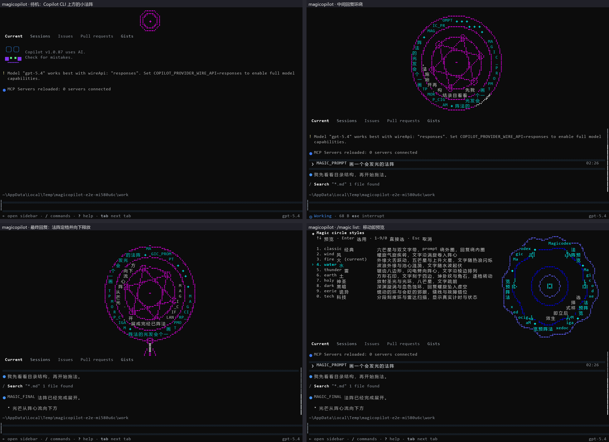

# magicopilot：GitHub Copilot CLI 魔法阵版

magicopilot 在你的终端里运行本机已安装、**未经修改**的 GitHub Copilot CLI，并在它上方加一块魔法阵区域：

- 输入前是一个小法阵；提交 prompt 后法阵变大，并随等待时间越来越大、越来越复杂，直到第一次回复；
- 你的 prompt 和中间回复（带工具调用的阶段性回复，不含 reasoning）环绕在法阵外圈和内圈；
- 最终回复到来时法阵定格，光从阵心向下释放，Copilot 的回答在法阵下方出现；定格的法阵保留 15 秒后暗淡下去、向外扩散成点尘，再缩回待机大小；
- 共 10 种法阵：classic 经典、wind 风、fire 火、water 水、thunder 雷、earth 土、holy 神圣、dark 黑暗、eerie 诡异、tech 科技。每种都有自己的外形、运动方式和文字路径，不只是换颜色；也可以选“随机”，每个回合换一种；
- 蓄力时法阵两侧是一本魔导书：左页“咏唱记录”把 Copilot 的工具调用写成法术，右页“施法状态”显示咏唱时长、施法阶段和计数；紧挨法阵的两根法阵柱随层数点亮，符文粒子向阵心汇聚，右下角的小猫使魔跟着吟唱、跑腿和欢呼。

Copilot CLI 自己的界面、快捷键、默认 prompt、斜杠命令、会话、认证和计费都不变：键盘、鼠标、粘贴原样交给 Copilot，只有 `/magic ...` 命令由外壳在回车时截获。



## 前提

- Windows 10 1809 及以上，x64；推荐 Windows Terminal（其他支持 VT 的控制台也可以）。
- 已安装并登录 GitHub Copilot CLI（`npm install -g @github/copilot`，或其他官方安装方式），`copilot` 在 PATH 中；也可以用 `--magic-copilot <路径>` 指定。已在 Copilot CLI 1.0.89 上验证。

## 安装

用 `install.ps1` 选择 **copilot** 版本安装（步骤见[仓库首页的“安装”](https://github.com/dengyanbo/Magicodex#安装)），或者解压发布包后直接运行 `magicopilot.exe`。发布包里的 `conpty.dll`、`OpenConsole.exe` 必须和 `magicopilot.exe` 放在同一目录。

## 使用

```powershell
magicopilot                        # 相当于运行 copilot，多了魔法阵
magicopilot --model gpt-5.4        # 其余参数原样交给 copilot
magicopilot --resume               # 恢复会话同样可以
magicopilot --magic-style 雷       # 以雷系法阵启动
magicopilot --magic-style 随机     # 每个回合随机换一种法阵
magicopilot --magic-help           # 外壳自己的参数
```

在 Copilot 的输入框里输入以下命令并回车：

| 命令 | 作用 |
| --- | --- |
| `/magic list`（或只输入 `/magic`） | 在法阵区域打开类型选择器：↑↓ 或 j/k 移动并实时预览，Enter 选用，1–9/0 直接选，Esc/q 取消；最后一项“?. random 随机”预览时先抽一种给你看，选用后下一回合就是它 |
| `/magic on` / `/magic off` | 显示 / 隐藏法阵；隐藏后 Copilot 恢复全屏高度 |
| `/magic <类型>` | 直接切换，例如 `/magic fire`、`/magic 火` |
| `/magic 随机`（或 `/magic random`） | 每个回合随机换一种法阵，不与上一回合相同；待机小阵显示的就是下一回合的法阵 |

Copilot 自己的命令列表里不会出现 `/magic`：那份列表由 Copilot 生成，外壳加不进去。所以在输入框里输入 `/` 或 `/magic` 的开头时，法阵区域左上角会显示 `/magic` 的用法，照常回车即可。

这些命令只在本机处理：不会发给模型，也不会留在 Copilot 的输入框里（命令后多打的空格、光标移回命令中间的情况也会清干净）。窗口太矮（低于 19 行）放不下选择器时，`/magic list` 只显示提示，可以改用 `/magic <类型>`；选择器打开后窗口被缩到这个高度以下，会自动取消并还原预览。设置只在本次运行中有效；想要默认值，可以用启动参数或环境变量：

| 参数 | 环境变量 | 说明 |
| --- | --- | --- |
| `--magic-style <类型>` | `MAGICOPILOT_STYLE` | 初始法阵类型（英文名或中文名），或 `random`/`随机` |
| `--magic-off` | `MAGICOPILOT_OFF=1` | 启动时隐藏法阵 |
| `--magic-no-motion` | `MAGICOPILOT_NO_MOTION=1` | 不播放动画，直接画出完整法阵 |
| `--magic-copilot <路径>` | `MAGICOPILOT_COPILOT` | 使用指定的 Copilot CLI |
| | `MAGICOPILOT_LOG=<文件>` | 调试日志（包含 prompt 和终端数据，用完请删除） |

`-p/--prompt`、`--acp`、`--help`、`--version` 和子命令（`login`、`mcp`、`update` 等）不需要界面，会直接透传给 copilot，不显示法阵。

退出时，Copilot 打印在普通屏幕上的内容（例如退出摘要里的 `copilot --resume=<会话>`）会照常留在终端里，与直接运行一致。

## 工作方式

1. magicopilot 在伪终端（ConPTY）里启动 copilot，用 vt100 解析它的全屏界面，再和魔法阵区域一起合成到你的真实终端上。Copilot 的高度 = 窗口高度 − 法阵高度，所以两者不会重叠。
2. 法阵的内容来自 Copilot 实时写入的会话事件 `~/.copilot/session-state/<会话>/events.jsonl`：`user.message` 是 prompt，带工具调用的 `assistant.message` 是中间回复，`assistant.turn_end` 表示回复完成；`tool.execution_start/complete`、`subagent.started/completed/failed` 和 `skill.invoked` 写成两侧的法术，工具调用只取工具名和一项最能说明它的参数（搜索模式、文件名、命令第一行、网址、代理或技能名），子代理内部的调用只计数。reasoning 字段不会被读取或显示。新会话通过 `--session-id` 精确定位；`/resume`、`/new` 等切换会话时，按 Copilot 进程持有的会话锁文件找到新的事件文件。
3. 终端查询（颜色、能力、同步输出等）转发给真实终端，由真实终端回答；标题、进度条、剪贴板等控制序列原样转发。随包的 Windows Terminal 伪终端（`conpty.dll` + `OpenConsole.exe`）保证 Copilot 看到的是真实终端，界面与直接运行时一致。
4. 鼠标坐标按法阵高度平移后交给 Copilot，点击标签页、滚动等照常可用。
5. 查找 Copilot CLI：
   - 先找 PATH 中的 `copilot.exe`、`copilot.cmd`、`copilot.ps1`。路径按 Windows 的规则规范化：文件名末尾的点和空格会被去掉，`copilot.cmd.` 仍按批处理文件处理。
   - npm 安装的入口脚本会被解析成它实际启动的程序，直接运行。
   - 其他 `.cmd`/`.bat` 入口（pnpm、yarn、scoop 等）经 `cmd.exe` 运行，参数按 Rust 标准库对批处理文件的转义规则传递：`&`、`|`、`%变量%` 不会被 cmd 解释，含换行的参数会被拒绝。
   - `.ps1` 入口经 Windows PowerShell `-File` 运行，遵循你的执行策略。

## 布局与限制

- 法阵在顶部：待机 5 行，施法时 21 行，最终回复时 24 行，Copilot 至少保留 14 行。窗口低于 19 行时法阵自动隐藏；Copilot 请求权限确认时法阵缩回待机大小，把空间让给确认界面。
- 最终回复后，出口（24 行）保留 15 秒，这段时间 Copilot 的可用高度相应少 19 行；之后法阵连同两侧在 1.6 秒内暗淡、向外扩散并变稀，再回到待机。被中断或失败的回合没有出口，法阵直接这样消散。期间开始新的 prompt 会立即重新蓄力。`--magic-no-motion` 时只变暗、不移动，到时消失。
- 两侧内容只在蓄力与出口时出现，按窗口宽度逐级显示：65 列起法阵柱与粒子，89 列起两页魔导书，109 列起参数摘要与使魔；法阵区域不足 12 行（终端不足 26 行）时不显示。`--magic-no-motion` 时两侧同样静止。
- 超链接（OSC 8）和终端图片协议不转发；Copilot 的其他显示照常。
- `/magic` 截获和上面的用法提示都依赖 Copilot 输入框的外观（目前识别两种样式）。Copilot 改版后如果识别失败，提示不再出现，这行命令会原样交给 Copilot，只会得到“Unknown command”，不会发给模型。
- 会话事件格式属于 Copilot 的内部实现。格式变化时法阵会退化为只显示待机图案，不影响 Copilot 本身。
- 只支持 Windows。

## 许可

magicopilot 以 MIT 许可发布。随包的 `conpty.dll`、`OpenConsole.exe` 来自微软官方 NuGet 包 Microsoft.Windows.Console.ConPTY 1.24.260710001（MIT，微软签名，未修改）。依赖的 Rust crate 及其许可见 `THIRD-PARTY-NOTICES.md`。

magicopilot 不包含、不修改、不再分发 GitHub Copilot CLI；它启动的是你自己安装的副本，Copilot CLI 仍受其自身许可和条款约束。magicopilot 不是 GitHub 官方产品。

## 开发与验证

构建方法、测试命令与验证记录见[开发文档](https://github.com/dengyanbo/Magicodex/blob/main/docs/development.md#copilot-cli-外壳magicopilot)。
